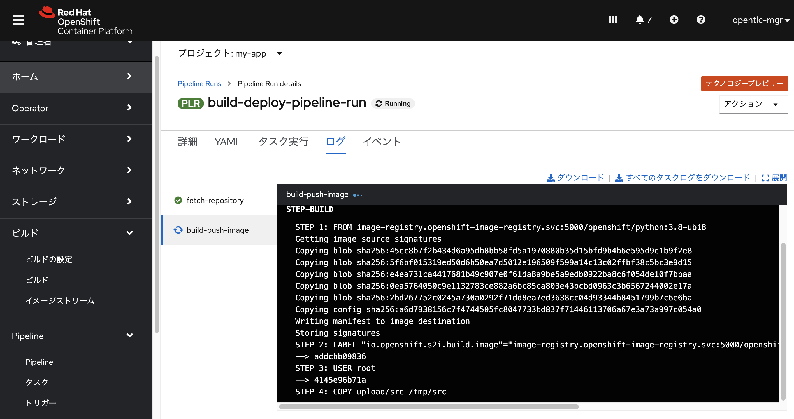

# Migration practice for python flask app
このレポジトリは、FlaskとMySQLで動作するAPIサービスのサンプルです。
アプリケーションは、ISUCON10の予選で利用されたものとなります。
本アプリケーションを、課題に沿ってOpenShiftクラスタで動作させる練習を行いましょう。

以下の環境での動作を確認しました。

- Python: 3.8, 3.9
- MySQL: 8
- OpenShift: 4.7

## ローカルでの動かし方
```
$ git clone https://github.com/mosuke5/migration-practice-for-flask
$ cd migration-practice-for-flask

// MySQLの準備
$ docker run --name isuumo-mysql -e MYSQL_DATABASE=isuumo -e MYSQL_USER=isucon -e MYSQL_PASSWORD=isucon -e MYSQL_RANDOM_ROOT_PASSWORD=yes -d -p 3306:3306 mysql:8
$ docker ps
CONTAINER ID   IMAGE     COMMAND                  CREATED         STATUS         PORTS                                                  NAMES
03ce1477f7fc   mysql:8   "docker-entrypoint.s…"   4 seconds ago   Up 2 seconds   0.0.0.0:3306->3306/tcp, :::3306->3306/tcp, 33060/tcp   isuumo-mysql

// 初期データのインポート
// もしMySQLの接続id/pwやホストを変えたい場合は環境変数で変更可能。
// init.sh内を参照しましょう。
$ sh db/init.sh
...
+ cat 0_Schema.sql 1_DummyEstateData.sql 2_DummyChairData.sql
+ mysql --defaults-file=/dev/null -h 127.0.0.1 -P 3306 -u isucon isuumo

$ mysql -u isucon -p -h 127.0.0.1
mysql> show databases;
+--------------------+
| Database           |
+--------------------+
| information_schema |
| isuumo             |
+--------------------+
2 rows in set (0.01 sec)

mysql> show tables;
+------------------+
| Tables_in_isuumo |
+------------------+
| chair            |
| estate           |
+------------------+
2 rows in set (0.01 sec)

mysql> select id,name from chair limit 10;
+----+-----------------------------------------------+
| id | name                                          |
+----+-----------------------------------------------+
|  1 | 【伝説の一品】普通のソファー                  |
|  2 | シンプル社長のハンモック                      |
|  3 | ふわふわアウトドアソファー                    |
|  4 | [残りわずか]アウトドアイス                    |
|  5 | こだわりの逸品パイプチェア                    |
|  6 | ふわふわアンティークな椅子                    |
|  7 | ふわふわ普通のイス                            |
|  8 | [期間限定]パイプ座椅子                        |
|  9 | エルゴノミクスボロい椅子                      |
| 10 | こだわりの逸品社長のパイプイス                |
+----+-----------------------------------------------+
10 rows in set (0.00 sec)

mysql> exit

// アプリケーションの依存ライブラリインストール
$ pip3 install -r requirement
...
Successfully installed Flask-1.1.2 SQLAlchemy-1.3.19 mysql-connector-python-8.0.21 pyhumps-1.6.1

// アプリケーションのDBへの接続情報は環境変数で調整可能
// app.pyを確認してみよう。
$ flask run
 * Environment: production
   WARNING: This is a development server. Do not use it in a production deployment.
   Use a production WSGI server instead.
 * Debug mode: off
 * Running on http://127.0.0.1:5000/ (Press CTRL+C to quit)

// APIリクエストのテスト1
$ curl http://localhost:5000/api/estate/low_priced | jq .
{
  "estates": [
    {
      "address": "滋賀県調布市雷門15丁目25番3号",
      "description": "そして百合さん、たとへこの手紙が書置の形式をなすとしても、敢て告別の言葉をこゝにくだくだしく書き遺しますまいね。",
      "doorHeight": 64,
      "doorWidth": 81,
...

// APIリクエストのテスト2
$ curl http://localhost:5000/api/chair/2 | jq .
{
  "color": "緑",
  "depth": 198,
  "description": "ことに、その変化がはやいのが類人猿で、つまり、ドドがたべる生果の量を減らして、その効果をいち早くみようというのだった。",
  "features": "オフィス用",
  "height": 173,
  "id": 2,
  "kind": "座椅子",
  "name": "シンプル社長のハンモック",
  "popularity": 855548,
  "price": 14605,
  "stock": 3,
  "thumbnail": "/images/chair/381e2b8ac021182c70069c5a975c209dc736bbdfed4d3d7f8d750339d1612279.png",
  "width": 77
}
```

## 回答例
### デプロイマニフェスト
`openshift/deploy.yaml`にOpenShift Templateで記述したマニフェストを作成しました。
利用するには以下のように扱えます。

```
$ oc process -f openshift/deploy.yaml -p APP_IMAGE=image-registry.openshift-image-registry.svc:5000/mosuke5-test/sample-flask -p APP_IMAGE_DIGEST=aaaa -o yaml
```

アプリケーションのイメージはタグ名ではなくダイジェスト値を指定する形式としています。理由は、Tekton Pipelineで利用できるS2I-python taskでは、コンテナイメージのビルド後にそのダイジェスト値をファイルで吐き出しており、使いやすかったためです。また、イメージをユニークとして扱うことができるためデプロイにも便利な点もあります。
このあたりは、実装方法にさまざまなパターンがあるので、一概に今回の方法が正解というわけではないです。

ヘルスチェック用に`/healthcheck`エンドポイントを追加しました。もちろん追加せずとも、既存の`/api/estate/low_priced`でも対応できますが、ヘルスチェック用途に大きなSQLを実行することが適切でなかったためです。

### パイプライン
Tektonを用いてパイプラインを構成しました。次のように実行できます。今回は、Webhookによる通知は作っていませんが、必要であればお知らせください。

```
$ oc apply -f openshift/tekton/pipeline.yaml
task.tekton.dev/apply-manifests configured
pipeline.tekton.dev/build-deploy-pipeline configured

$ oc get pipeline
NAME                    AGE
build-deploy-pipeline   33m

パイプライン実行
$ oc apply -f openshift/tekton/pipeline-run.yaml
pipelinerun.tekton.dev/build-deploy-pipeline-run created

パイプラインが動き始める
$ oc get pod
NAME                                                         READY   STATUS     RESTARTS   AGE
build-deploy-pipeline-run-fetch-repository-tzc9q-pod-fj2nj   0/1     Init:0/2   0          11s
```

Webコンソールからビルドの状況を確認できます。



初回デプロイ時は、データが入っておらずヘルスチェックが通らないため、アプリケーションが起動しません。初期データをロードしてあげましょう。

```
$ oc get pod
NAME                                                           READY   STATUS      RESTARTS   AGE
build-deploy-pipeline-run-build-push-image-znkpr-pod-mjjw8     0/4     Completed   0          5m24s
build-deploy-pipeline-run-deploy-application-nq4f4-pod-9k747   0/1     Completed   0          102s
build-deploy-pipeline-run-fetch-repository-tzc9q-pod-fj2nj     0/1     Completed   0          5m56s
mysql-0                                                        1/1     Running     0          11m
sample-flask-57cddd787f-qhntz                                  0/1     Running     1          92s
```